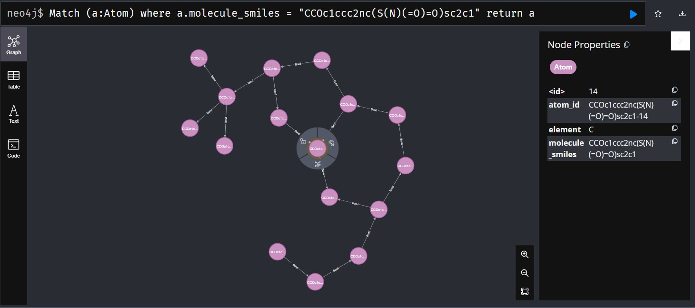

# Using molecular knowledge graphs for toxicity prediction with GNNs

## Steps:
Status: ❌/✅ 

- Find suitable datasets ✅
- Transform the molecules into knowledge graph representations ✅
- Store the model using neo4j ✅
- Load the model using neo4j ❌
- Create a suitable pyG graph from the molecules ❌
- Implement a simple GNN ❌
- Use the GNN to predict toxicity ❌


## Datasets:


neoj4 pw: "postgres"


## Loading molecules from neo4j

Get all distinct molecule ids: 

```sql
MATCH (a:Atom) 
RETURN DISTINCT a.molecule_smiles 
```

Generates list of all molecule SMILES strings

To query a specific molecule:

```sql
MATCH (a:Atom) 
WHERE a.molecule_smiles = "<smiles_string>" 
RETURN a
```
which conveniently returns the entire molecule with all of its bonds

