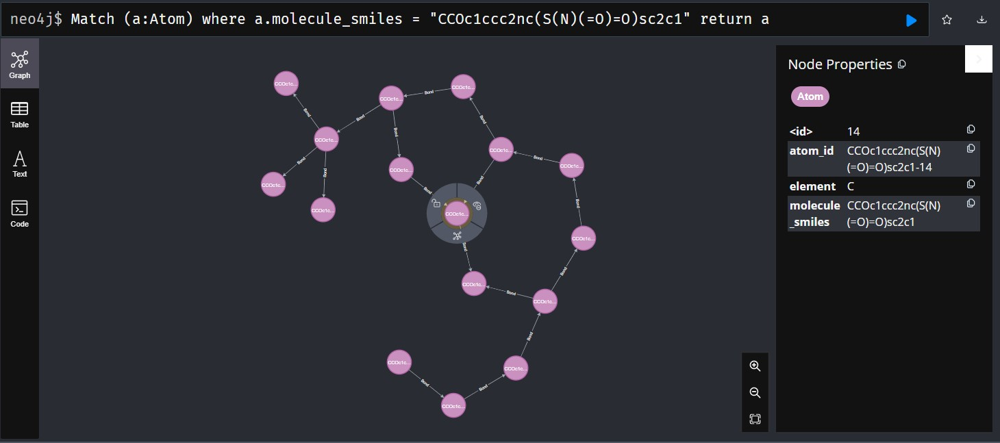

# Using molecular knowledge graphs for toxicity prediction with GNNs

## Steps:
Status: ❌/✅ 

- Find suitable datasets ✅
- Transform the molecules into knowledge graph representations ✅
  - select suitable label for learning task and add it to representation ✅
- Store the model using neo4j ✅
- Load the model using neo4j ✅
- Create a suitable pyG graph from the molecules ✅
- Implement a simple GNN ✅
- Use the GNN to predict toxicity ✅


## Getting started:

Install all the required dependencies by running

```bash
pip install -r requirements.txt
```


## Datasets:

The [Tox21](https://deepchemdata.s3-us-west-1.amazonaws.com/datasets/tox21.csv.gz) data set is used in the project. 
The dataset is already included in the repository.

## Parsing the data

To parse the data and place it in a neo4j database simply run
Make sure to have an empty neo4j database running at `bolt://localhost:7687` with the password set to `postgres` to be compatible.
```bash
cd src
python python .\parse_and_store_datasets.py
```

## Loading molecules from neo4j

Get all distinct molecule ids: 

```sql
MATCH (a:Atom) 
RETURN DISTINCT a.molecule_smiles 
```

Generates list of all molecule SMILES strings

To query a specific molecule:

```sql
MATCH (a:Atom) 
WHERE a.molecule_smiles = "<smiles_string>" 
RETURN a
```
which conveniently returns the entire molecule with all of its bonds



## Perform database extraction and model training

Simply run

```bash
cd src
python python .\load_data_and_train_gnn.py
```

## Start the web app

Make sure `localhost:5000` is available and run

```bash
cd src\web-app
python python .\app.py
```

The browser window should open automatically